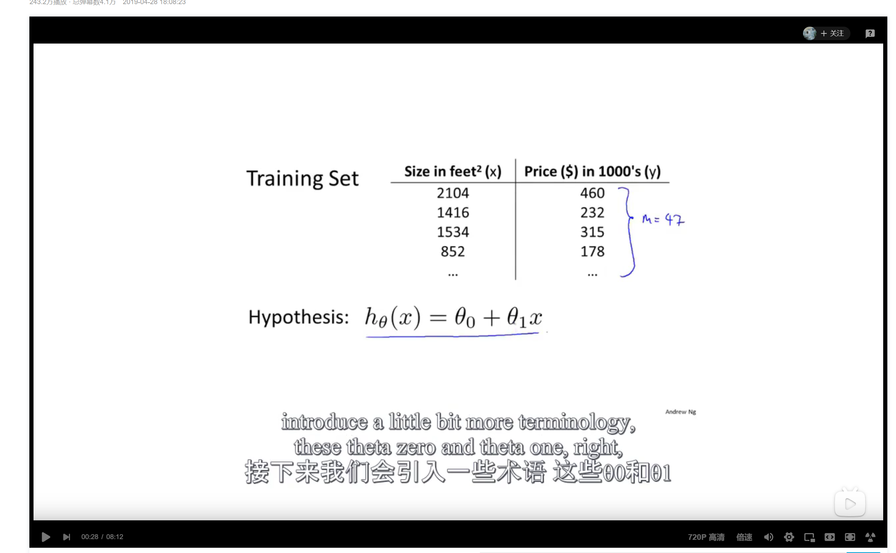

# 目录

## 1.概念

## 2.监督学习(supervised learning)

概念：我们给算法一个数据集，其中包含了正确的答案，然后让计算机进行预测出别的正确答案。 eg：有好几组房价和面积的价格的数据，预估出另一个面积的房价多少。 回归问题:预测连续值 分类问题：例如肿瘤的恶性和良性

## 3.无监督学习(unsupervised learning)

聚类算法(clustering algorithms)：一堆没有标签的数据集进行划分种类

> 例如谷歌新闻里，把爬虫到的新闻自动归类

## 4.模型描述

符号说明 |符号|说明| |-|-|-| |m|训练集数量| |x|输入值| |y|输出结果|

> 例如要预测房价，有一组训练集，个数就为m，x代表房子大小，y代表房价

